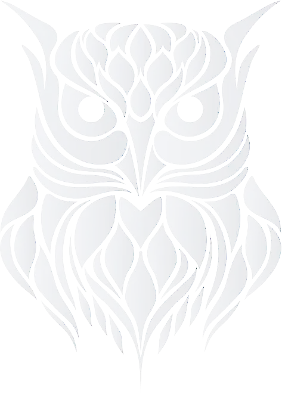

# Nuxt 3 Snowowl Starter Template

<a href="https://github.com/momoathome/NuxtTemplate"></a>
  
Look at the [nuxt 3 documentation](https://v3.nuxtjs.org) to learn more.

<br>

## Features

* 💨 [nuxt-unocss](https://github.com/unocss/unocss) - The instant on-demand Atomic CSS engine.
* 🤹 [preset-icons](https://github.com/unocss/unocss/tree/main/packages/preset-icons/) - Use icons from any iconsets with unocss
* 🍍 [@pinia/nuxt](https://pinia.esm.dev/ssr/nuxt.html) - Using Pinia with Nuxt.js 3
* 🛠️ [@vueuse/nuxt3](https://vueuse.org/nuxt/readme.html#vueuse-nuxt) - This is an add-on of VueUse, which provides better Nuxt integration auto-import capabilities.

## Use the Template

### GitHub Template

[create a repo from this template on GitHub](https://github.com/momoathome/NuxtTemplate/generate)

### Clone to local

```bash
$> npx nuxi init -t momoathome/NuxtTemplate nuxt-app
$> 🎉  Another snowy Nuxt project just made! Next steps:
$>
$>    📁  `cd nuxt-app`
$>
$>    💿  Install dependencies with `npm install` or `yarn install` or `pnpm install --shamefully-hoist`
$>
$>    🚀  Start development server with `npm run dev` or `yarn dev` or `pnpm run dev`
```

## Setup

Make sure to install the dependencies:

```bash
# yarn
yarn install

# npm
npm install

# pnpm
pnpm install --shamefully-hoist
```

## Development Server

Start the development server on http://localhost:3000

```bash
npm run dev -o
```

## Production

Build the application for production:

```bash
npm run build
```

Locally preview production build:

```bash
npm run preview
```

Checkout the [deployment documentation](https://v3.nuxtjs.org/guide/deploy/presets) for more information.
